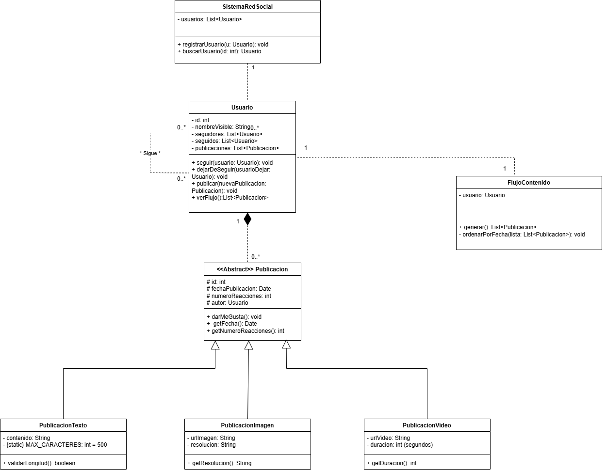

# Red Social en Java

Simulación de una red social con funciones básicas, utilizando Programación Orientada a Objetos.

## Integrantes del grupo

- Jenifer Samboni
- Beyker Ceron
- Santiago Ruano

## Diagrama UML del sistema

## Estructura del proyecto

- Usuario.java
- Publicacion.java
- PublicacionTexto.java
- PublicacionImagen.java
- PublicacionVideo.java
- FlujoContenido.java
- SistemaRedSocial.java
- main.java
